# Room Android 客户端逻辑设计

本文描述 Android 客户端第一版的页面流转、状态流转、接口调用和 WebSocket 事件处理逻辑。

## 总体页面流转

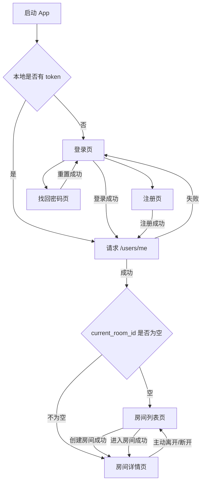

## 登录态恢复

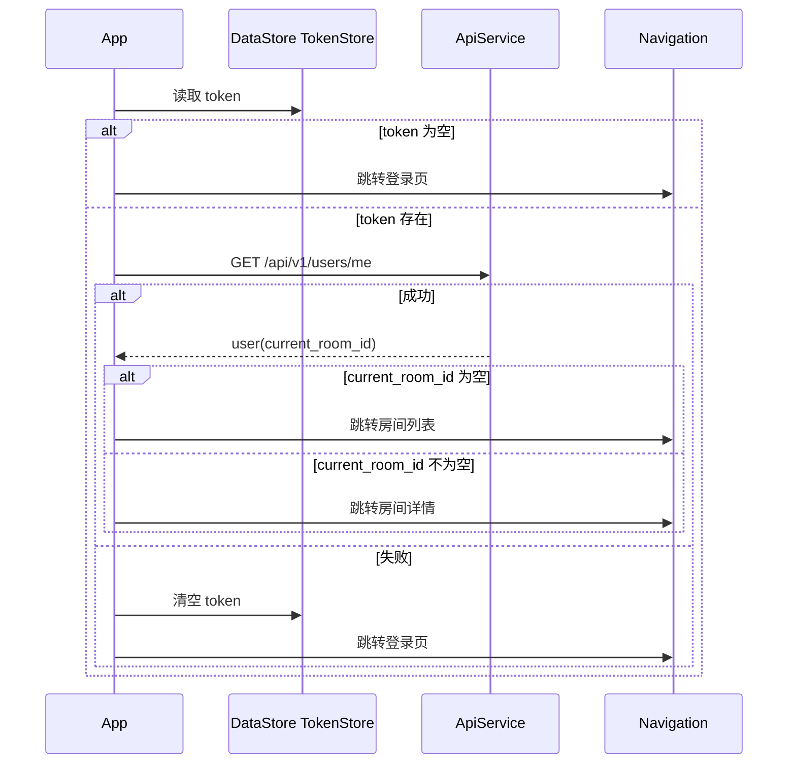

## 注册流程

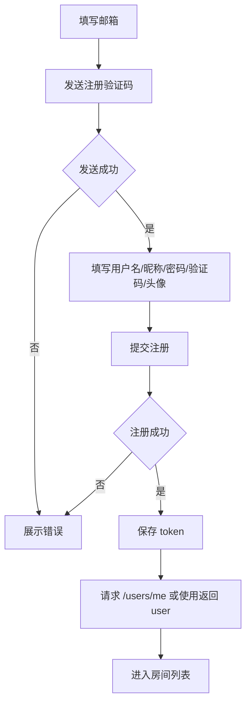

## 登录流程

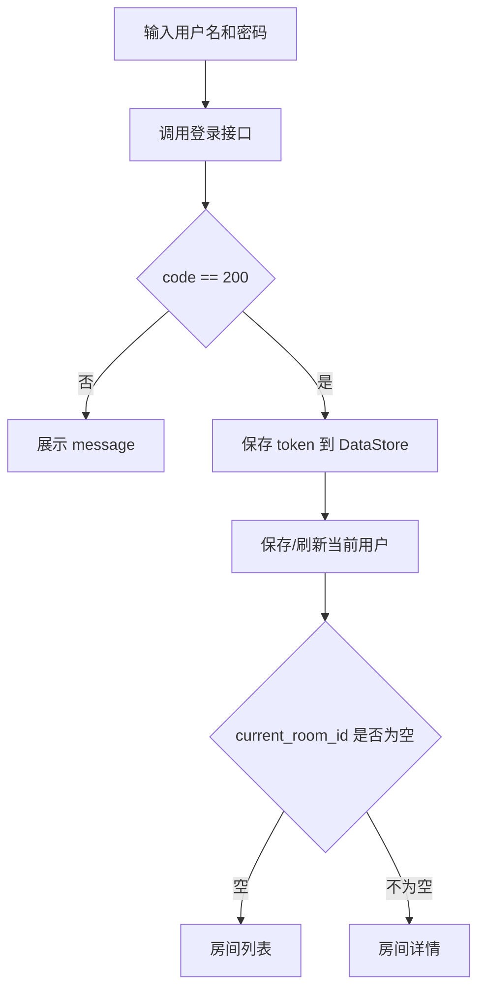

## 房间列表逻辑

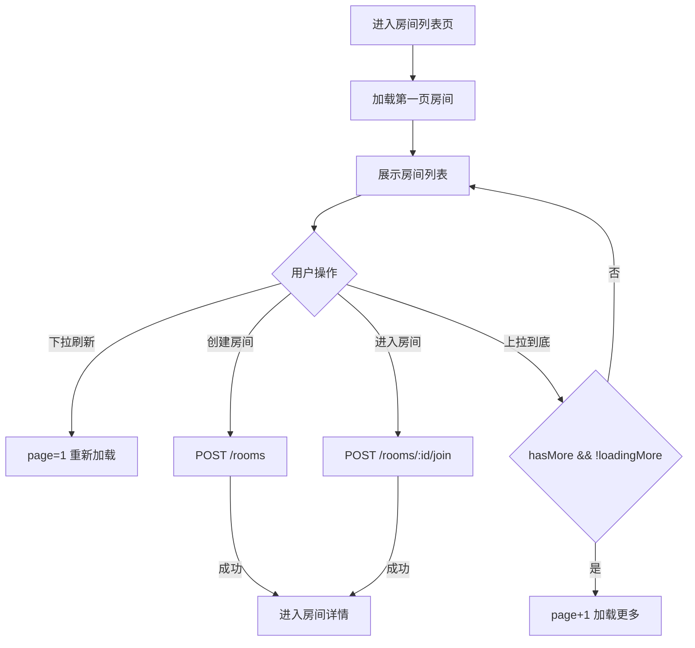

房间列表状态：

```kotlin
data class RoomListUiState(
    val rooms: List<Room> = emptyList(),
    val page: Int = 1,
    val pageSize: Int = 20,
    val isRefreshing: Boolean = false,
    val isLoadingMore: Boolean = false,
    val hasMore: Boolean = true,
    val errorMessage: String? = null
)
```

## 房间详情初始化

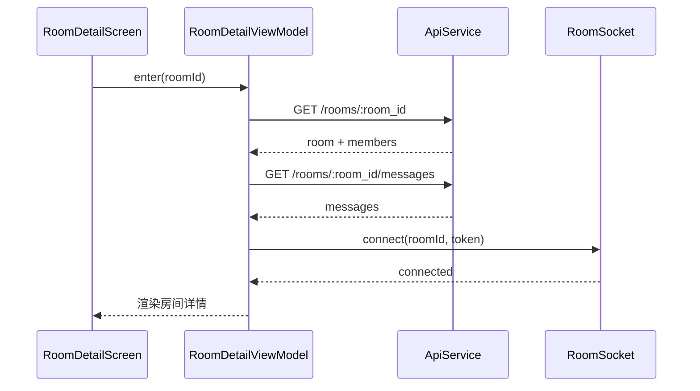

## 房间详情状态

```kotlin
data class RoomDetailUiState(
    val room: Room? = null,
    val members: List<RoomMember> = emptyList(),
    val messages: List<Message> = emptyList(),
    val isLoading: Boolean = false,
    val isLoadingMoreMessages: Boolean = false,
    val hasMoreMessages: Boolean = true,
    val socketState: SocketState = SocketState.Disconnected,
    val inputText: String = "",
    val errorMessage: String? = null
)
```

## 消息加载和发送

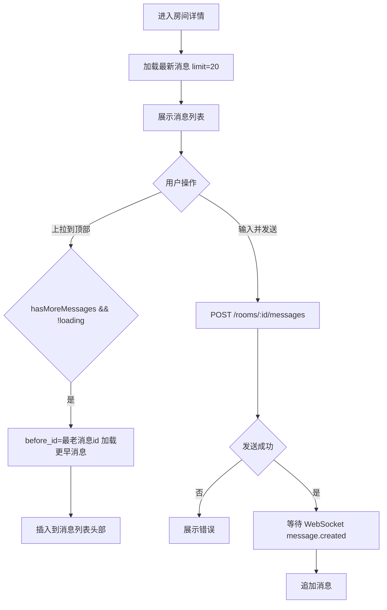

说明：

- 第一版不做客户端消息 ID。
- 发送成功后不立即本地插入，优先等待后端 WebSocket 广播，避免重复消息。
- 如果后续需要更强的发送体验，可改为“本地临时消息 + WebSocket 确认”。

## WebSocket 事件处理

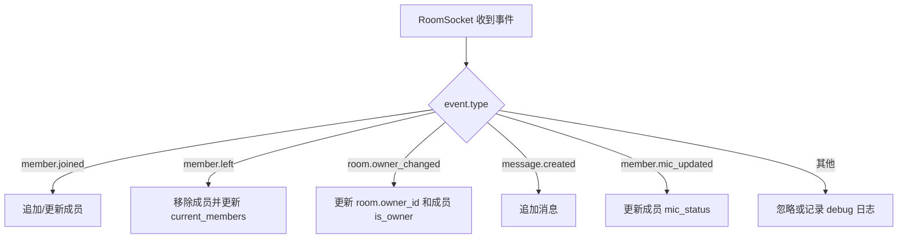

事件处理规则：

- `member.joined`：如果成员已存在则覆盖，否则追加。
- `member.left`：按 `user_id` 删除成员。
- `room.owner_changed`：以事件里的 `owner_id` 更新房间房主；如果事件携带成员列表，则直接覆盖成员列表。
- `message.created`：按消息 `id` 去重后追加。
- `member.mic_updated`：按 `user_id` 更新麦克风状态。

## 离开房间和断开连接

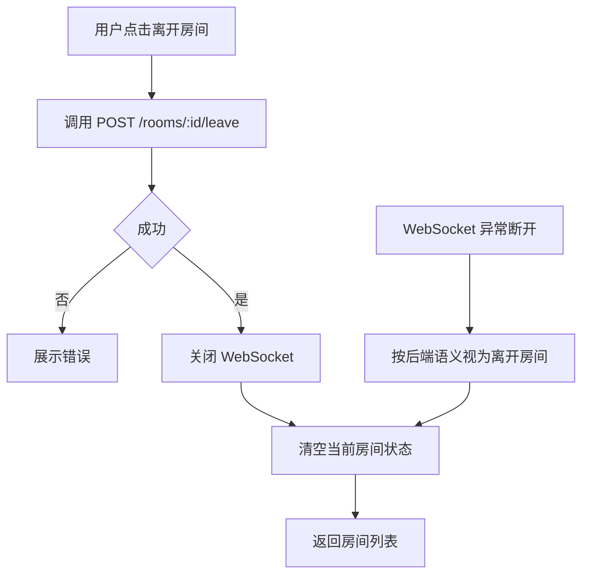

说明：

- 第一版不做断线自动保留席位。
- 页面退出房间时主动关闭 WebSocket。
- 如果 App 进入后台导致连接断开，重新进入时通过 `/users/me` 或房间接口同步真实状态。

## 麦克风状态更新

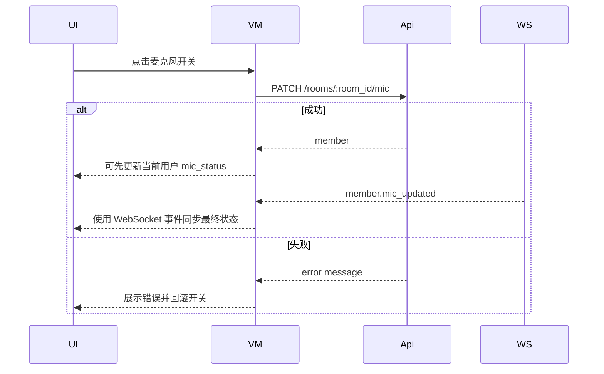

## 头像上传流程

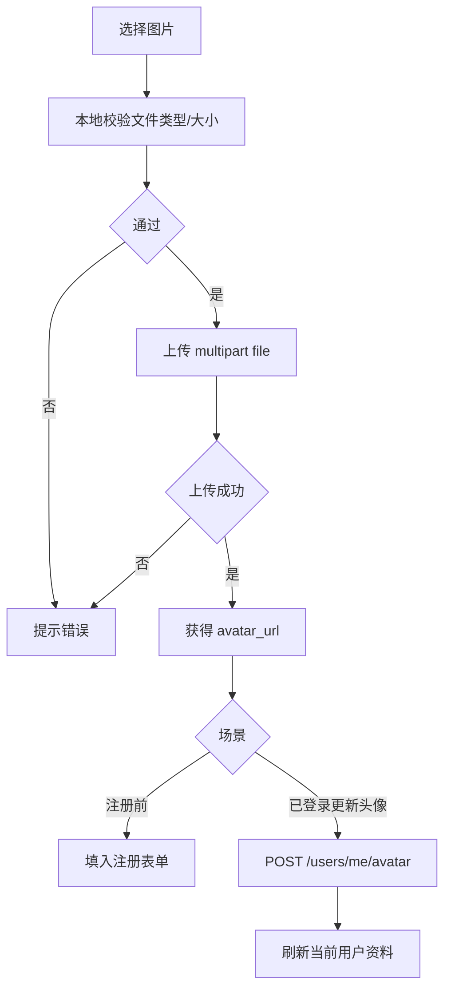

## 错误处理

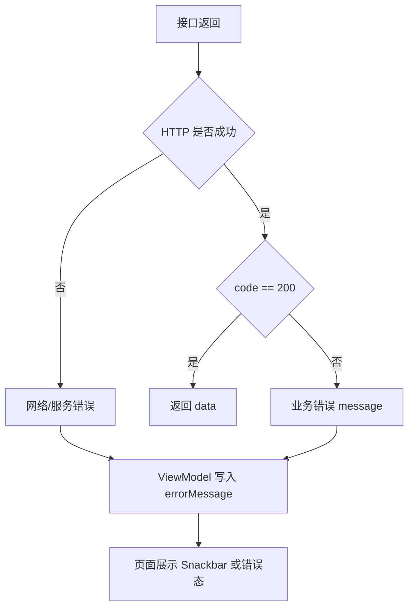

原则：

- 业务失败优先展示后端 `message`。
- 网络失败展示通用网络错误。
- 表单错误留在当前页面，不跳转。
- 登录态失效时清空 token 并回登录页。

## Hilt 依赖关系

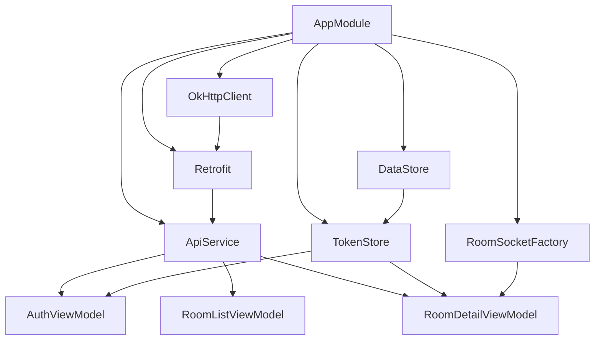

第一版不强制 Repository 层，ViewModel 可以直接注入需要的服务。后续如果 ViewModel 明显变胖，再抽出 Repository 或 UseCase。
