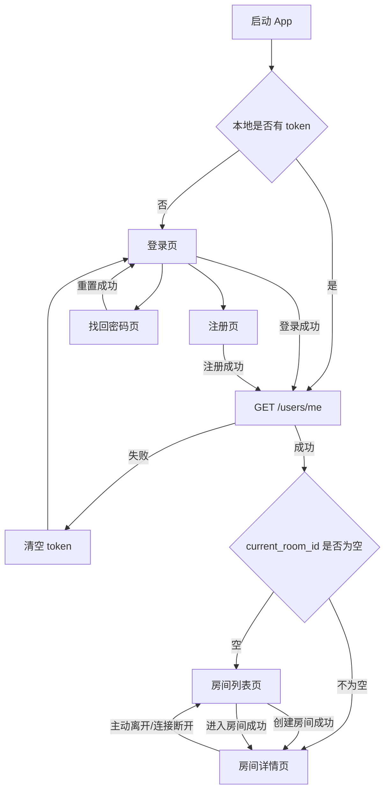
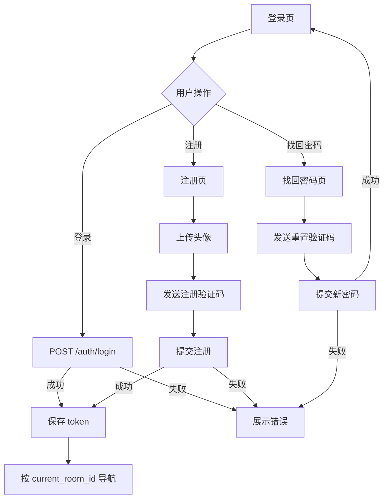
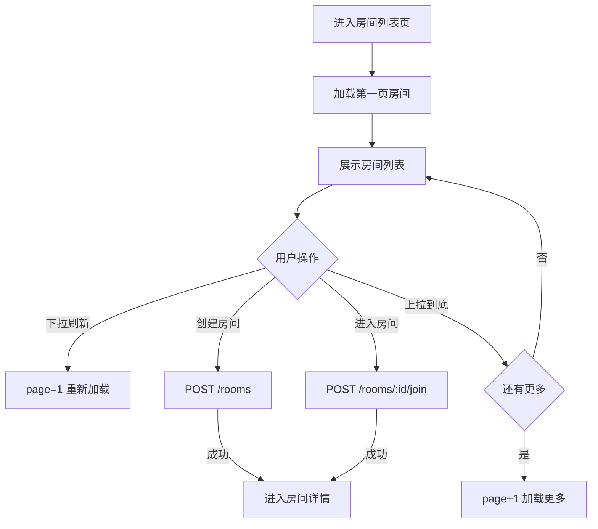
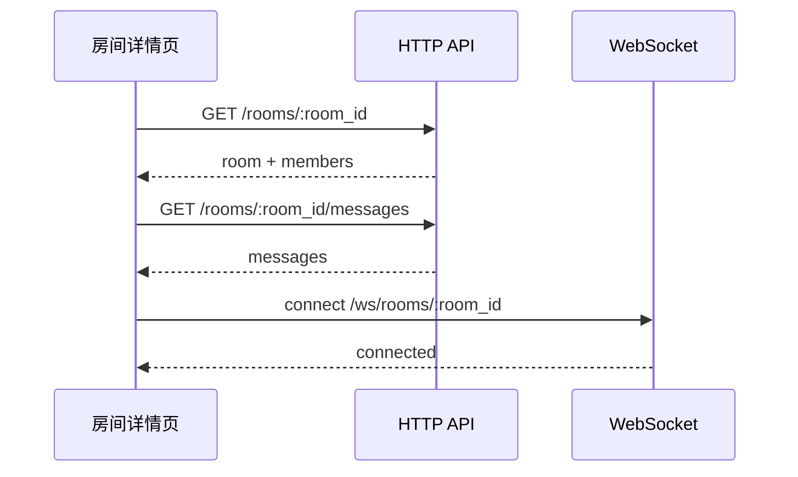
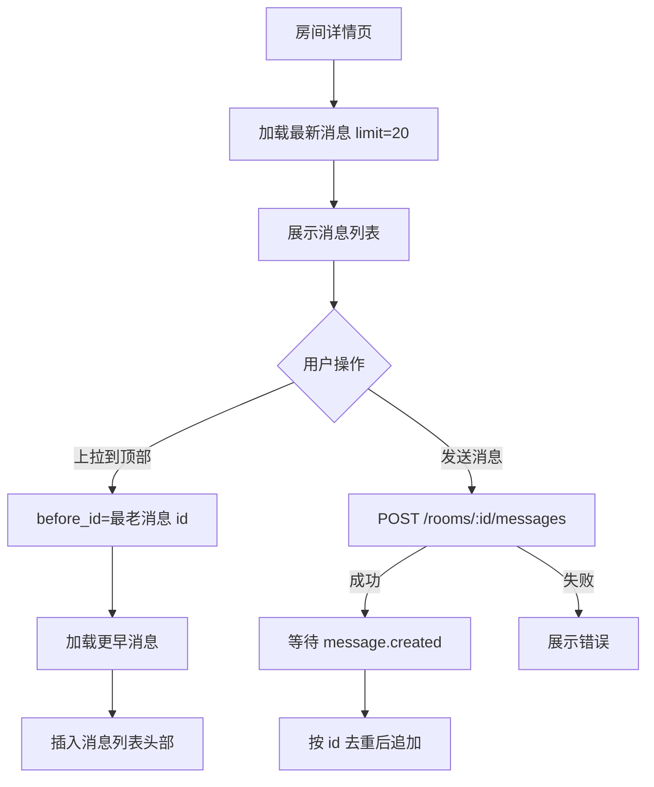
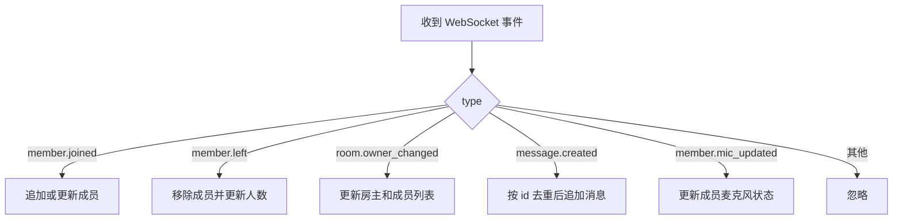
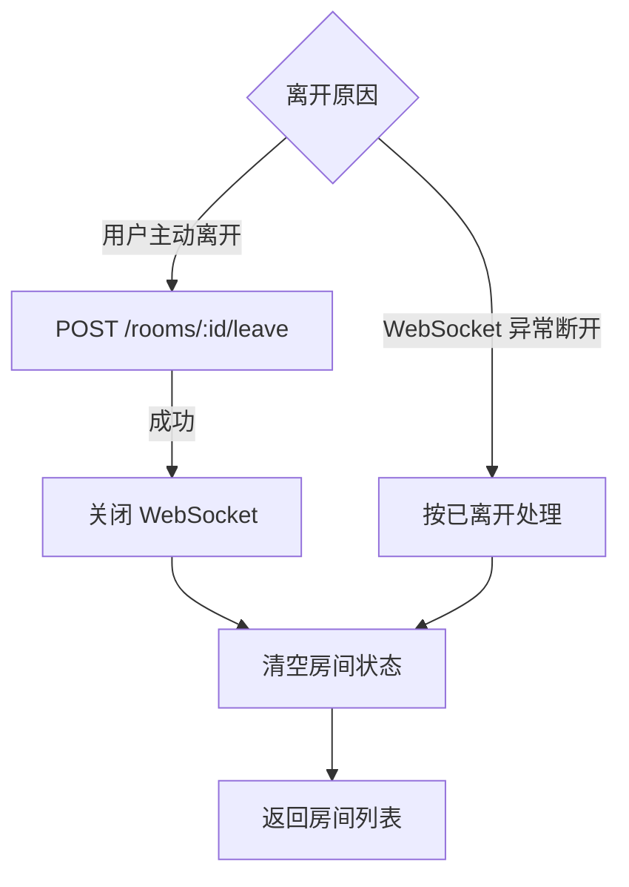
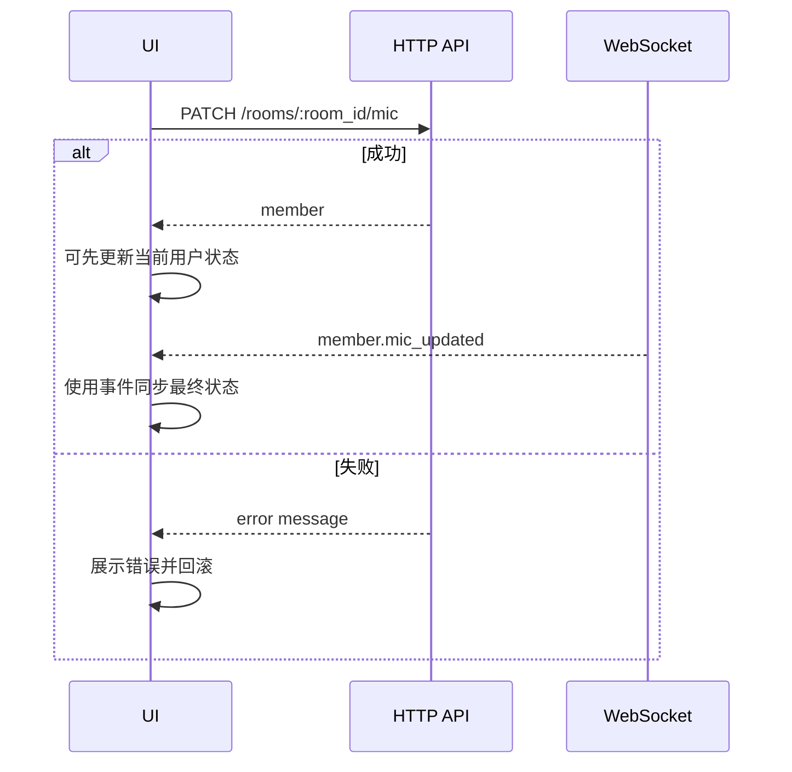
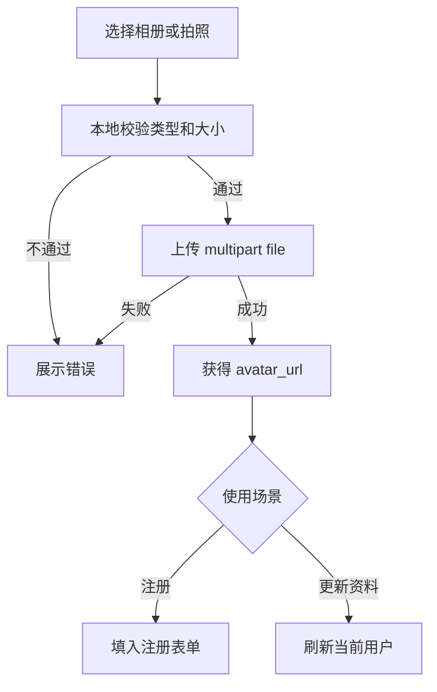

# Room Android 客户端逻辑设计

本文只保留客户端主流程图。代码结构、模型、API 签名、ViewModel 和页面细节见 `docs/实现规格.md`。

## 总体页面流转

```mermaid
flowchart TD
    A[启动 App] --> B{本地是否有 token}
    B -- 否 --> C[登录页]
    B -- 是 --> D[GET /users/me]
    D -- 失败 --> E[清空 token]
    E --> C
    D -- 成功 --> F{current_room_id 是否为空}
    F -- 空 --> G[房间列表页]
    F -- 不为空 --> H[房间详情页]

    C --> I[注册页]
    C --> J[找回密码页]
    C -- 登录成功 --> D
    I -- 注册成功 --> D
    J -- 重置成功 --> C

    G -- 创建房间成功 --> H
    G -- 进入房间成功 --> H
    H -- 主动离开/连接断开 --> G
```

## 认证流程

```mermaid
flowchart TD
    A[登录页] --> B{用户操作}
    B -- 登录 --> C[POST /auth/login]
    B -- 注册 --> D[注册页]
    B -- 找回密码 --> E[找回密码页]

    C -- 成功 --> F[保存 token]
    F --> G[按 current_room_id 导航]
    C -- 失败 --> H[展示错误]

    D --> I[上传头像]
    I --> J[发送注册验证码]
    J --> K[提交注册]
    K -- 成功 --> F
    K -- 失败 --> H

    E --> L[发送重置验证码]
    L --> M[提交新密码]
    M -- 成功 --> A
    M -- 失败 --> H
```

## 房间列表流程

```mermaid
flowchart TD
    A[进入房间列表页] --> B[加载第一页房间]
    B --> C[展示房间列表]
    C --> D{用户操作}
    D -- 下拉刷新 --> E[page=1 重新加载]
    D -- 上拉到底 --> F{还有更多}
    F -- 是 --> G[page+1 加载更多]
    F -- 否 --> C
    D -- 创建房间 --> H[POST /rooms]
    D -- 进入房间 --> I[POST /rooms/:id/join]
    H -- 成功 --> J[进入房间详情]
    I -- 成功 --> J
```

## 房间详情进入流程

```mermaid
sequenceDiagram
    participant UI as 房间详情页
    participant Api as HTTP API
    participant WS as WebSocket

    UI->>Api: GET /rooms/:room_id
    Api-->>UI: room + members
    UI->>Api: GET /rooms/:room_id/messages
    Api-->>UI: messages
    UI->>WS: connect /ws/rooms/:room_id
    WS-->>UI: connected
```

## 消息流程

```mermaid
flowchart TD
    A[房间详情页] --> B[加载最新消息 limit=20]
    B --> C[展示消息列表]
    C --> D{用户操作}
    D -- 上拉到顶部 --> E[before_id=最老消息 id]
    E --> F[加载更早消息]
    F --> G[插入消息列表头部]
    D -- 发送消息 --> H[POST /rooms/:id/messages]
    H -- 成功 --> I[等待 message.created]
    I --> J[按 id 去重后追加]
    H -- 失败 --> K[展示错误]
```

## WebSocket 事件

```mermaid
flowchart TD
    A[收到 WebSocket 事件] --> B{type}
    B -- member.joined --> C[追加或更新成员]
    B -- member.left --> D[移除成员并更新人数]
    B -- room.owner_changed --> E[更新房主和成员列表]
    B -- message.created --> F[按 id 去重后追加消息]
    B -- member.mic_updated --> G[更新成员麦克风状态]
    B -- 其他 --> H[忽略]
```

## 离开和断开

```mermaid
flowchart TD
    A{离开原因} -- 用户主动离开 --> B[POST /rooms/:id/leave]
    B -- 成功 --> C[关闭 WebSocket]
    C --> D[清空房间状态]
    D --> E[返回房间列表]

    A -- WebSocket 异常断开 --> F[按已离开处理]
    F --> D
```

## 麦克风状态

```mermaid
sequenceDiagram
    participant UI
    participant Api as HTTP API
    participant WS as WebSocket

    UI->>Api: PATCH /rooms/:room_id/mic
    alt 成功
        Api-->>UI: member
        UI->>UI: 可先更新当前用户状态
        WS-->>UI: member.mic_updated
        UI->>UI: 使用事件同步最终状态
    else 失败
        Api-->>UI: error message
        UI->>UI: 展示错误并回滚
    end
```

## 头像上传

```mermaid
flowchart TD
    A[选择相册或拍照] --> B[本地校验类型和大小]
    B -- 通过 --> C[上传 multipart file]
    B -- 不通过 --> D[展示错误]
    C -- 成功 --> E[获得 avatar_url]
    C -- 失败 --> D
    E --> F{使用场景}
    F -- 注册 --> G[填入注册表单]
    F -- 更新资料 --> H[刷新当前用户]
```
