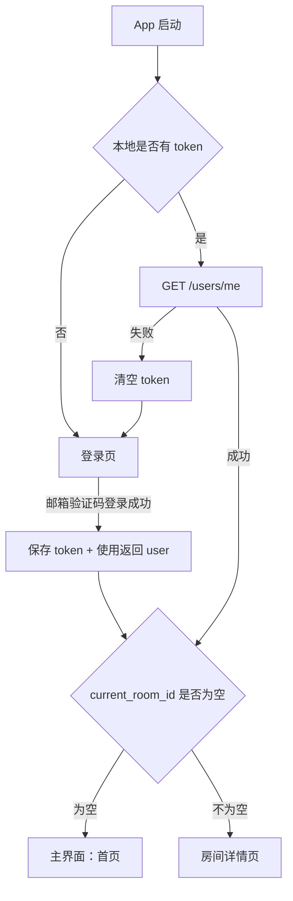
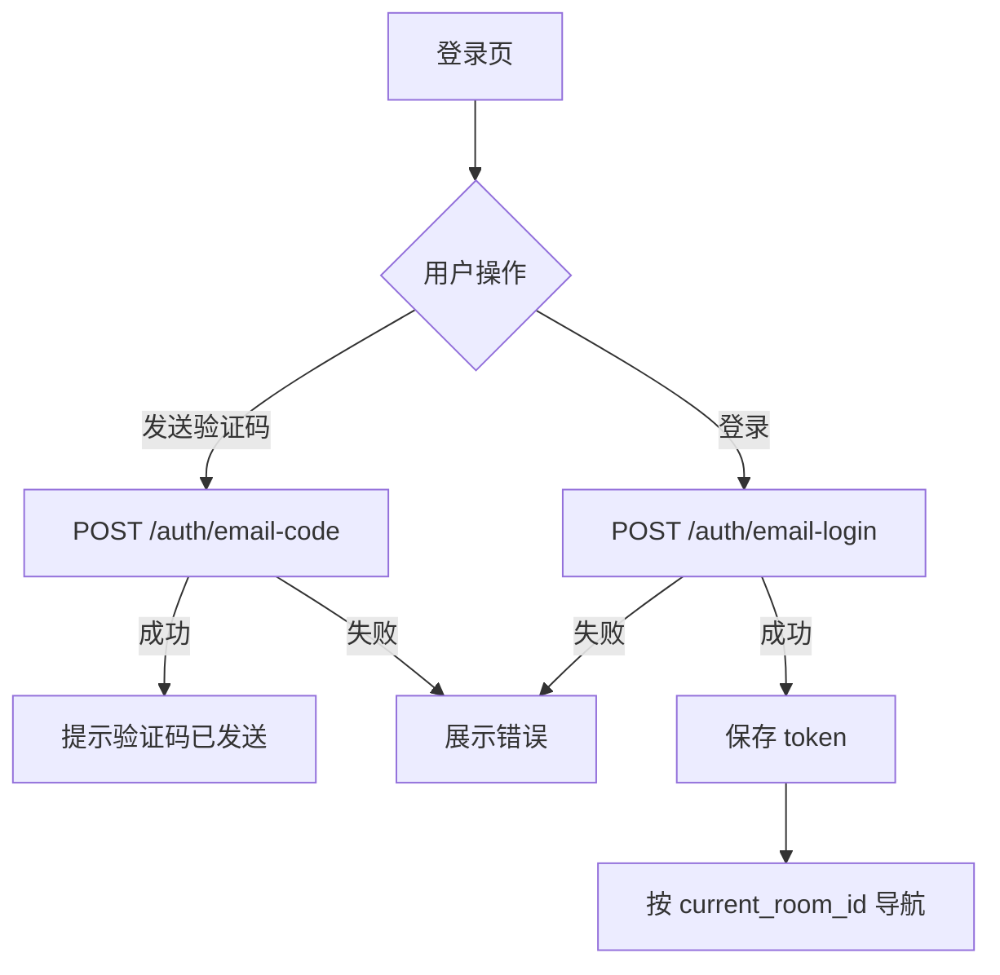
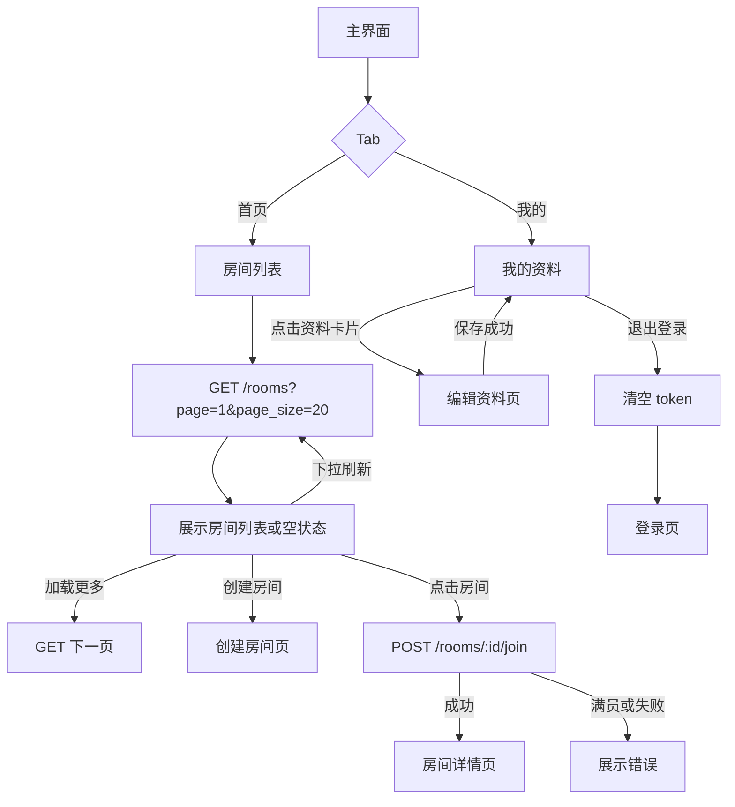
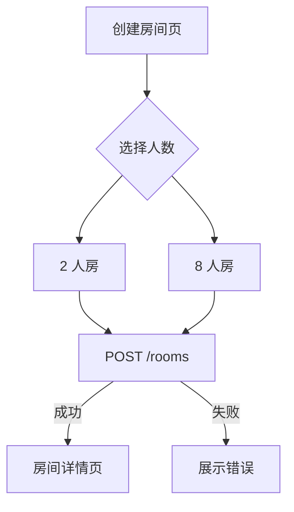
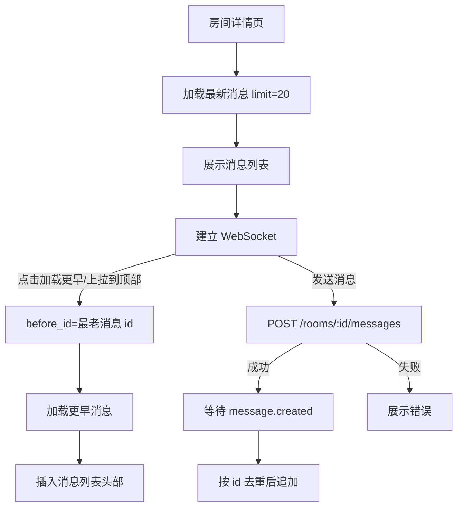
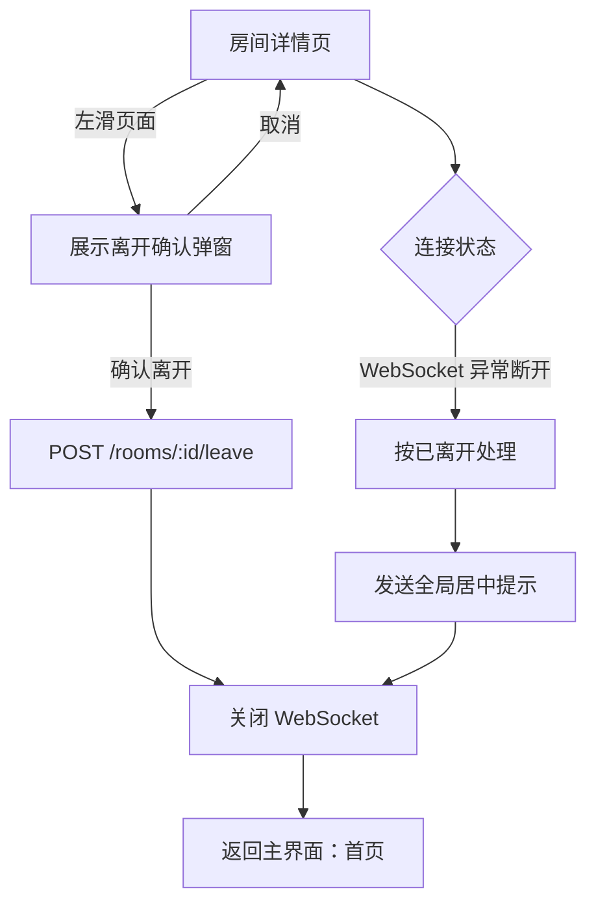
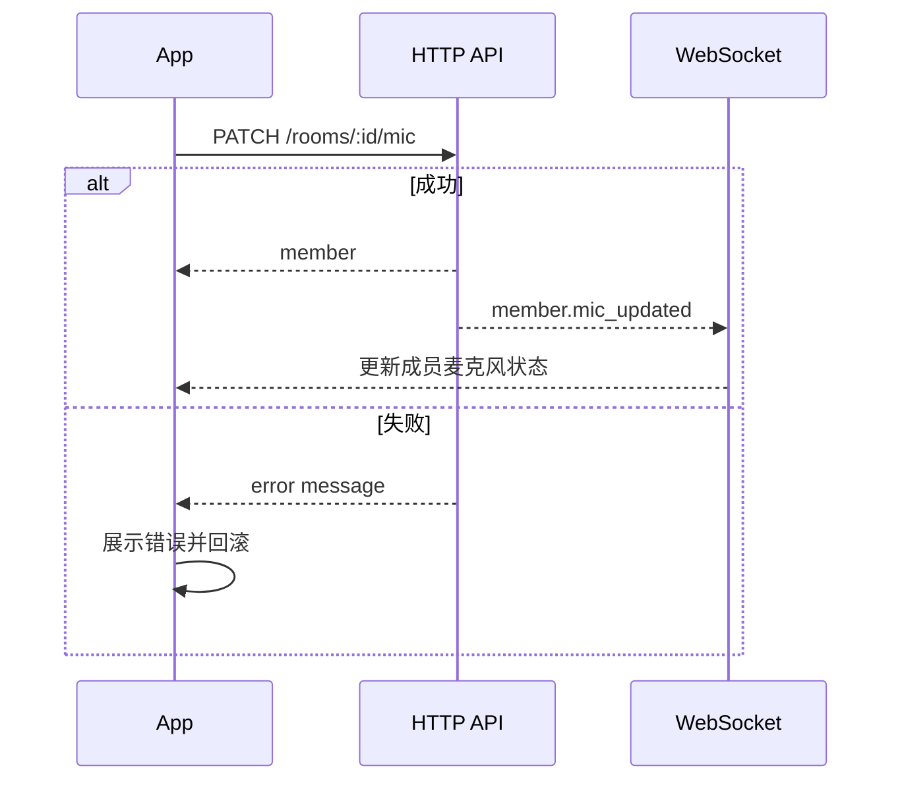
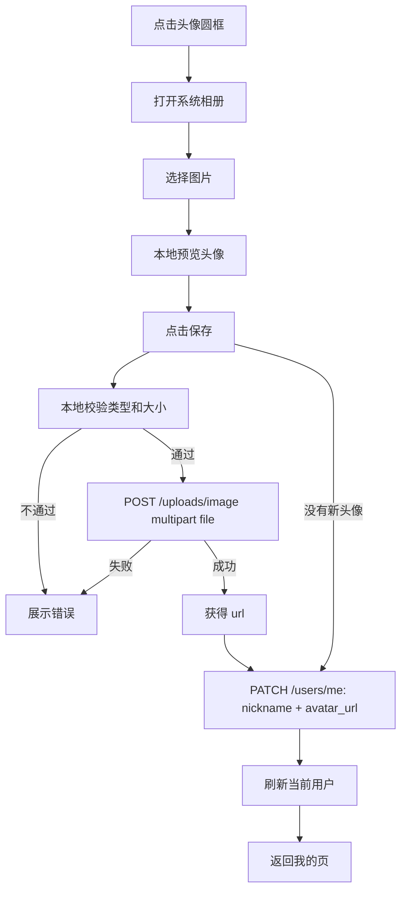

# Room Android 客户端逻辑设计

## 启动流程

```mermaid
flowchart TD
    A[App 启动] --> B{本地是否有 token}
    B -- 否 --> C[登录页]
    B -- 是 --> D[GET /users/me]
    D -- 失败 --> E[清空 token]
    E --> C
    D -- 成功 --> F{current_room_id 是否为空}
    F -- 为空 --> G[主界面：首页]
    F -- 不为空 --> H[房间详情页]

    C -- 邮箱验证码登录成功 --> K[保存 token + 使用返回 user]
    K --> F
```

## 认证流程

流程图中的“展示错误”均指调用 MessageCenter，由 app 级 CenterMessageHost 居中展示。

```mermaid
flowchart TD
    A[登录页] --> B{用户操作}
    B -- 发送验证码 --> C[POST /auth/email-code]
    C -- 成功 --> D[提示验证码已发送]
    C -- 失败 --> E[展示错误]
    B -- 登录 --> F[POST /auth/email-login]
    F -- 成功 --> G[保存 token]
    G --> H[按 current_room_id 导航]
    F -- 失败 --> E
```

邮箱验证码登录规则：

- 登录页只保留邮箱、验证码和登录按钮。
- 不再提供单独注册账号入口。
- 不再提供忘记密码/重置密码入口。
- 未注册邮箱由后端在邮箱验证码登录成功时自动注册并登录。

## 主页流程

```mermaid
flowchart TD
    A[主界面] --> B{Tab}
    B -- 首页 --> C[房间列表]
    B -- 我的 --> D[我的资料]

    C --> E[GET /rooms?page=1&page_size=20]
    E --> F[展示房间列表或空状态]
    F -- 下拉刷新 --> E
    F -- 加载更多 --> G[GET 下一页]
    F -- 创建房间 --> H[创建房间页]
    F -- 点击房间 --> I[POST /rooms/:id/join]
    I -- 成功 --> J[房间详情页]
    I -- 满员或失败 --> K[展示错误]

    D -- 点击资料卡片 --> L[编辑资料页]
    L -- 保存成功 --> D
    D -- 退出登录 --> M[清空 token]
    M --> N[登录页]
```

首页刷新只通过列表下拉刷新触发；右上角不提供刷新按钮，只保留创建房间入口。空状态同样放在可下拉刷新的列表容器内。

进入房间使用独立的 `joiningRoomId` 标记当前点击项，右侧显示“进入中”；该状态不复用首页列表刷新 `loading`。

我的页资料卡片展示头像、昵称和邮箱地址，点击整张卡片进入编辑资料页；退出登录按钮放在底部区域。

编辑资料保存成功后只更新全局用户状态并导航回 `main/me`，不使用会回到首页的默认用户路由。

## 房间创建流程

```mermaid
flowchart TD
    A[创建房间页] --> B{选择人数}
    B --> C[2 人房]
    B --> D[8 人房]
    C --> E[POST /rooms]
    D --> E
    E -- 成功 --> F[房间详情页]
    E -- 失败 --> G[展示错误]
```

## 消息流程

```mermaid
flowchart TD
    A[房间详情页] --> B[加载最新消息 limit=20]
    B --> C[展示消息列表]
    C --> D[建立 WebSocket]
    D -- 点击加载更早/上拉到顶部 --> E[before_id=最老消息 id]
    E --> F[加载更早消息]
    F --> G[插入消息列表头部]
    D -- 发送消息 --> H[POST /rooms/:id/messages]
    H -- 成功 --> I[等待 message.created]
    I --> J[按 id 去重后追加]
    H -- 失败 --> K[展示错误]
```

WebSocket 使用 OkHttp 10 秒 ping 保活。主动离开不展示断线提示；异常断开按后端语义视为已离开房间，返回首页，并通过 app 级 MessageCenter 居中展示一次“连接已断开，已离开房间”。

## 离开和断开

```mermaid
flowchart TD
    A[房间详情页] --> B{连接状态}
    A -- 左滑页面 --> C[展示离开确认弹窗]
    C -- 取消 --> A
    C -- 确认离开 --> D[POST /rooms/:id/leave]
    D --> E[关闭 WebSocket]
    E --> F[返回主界面：首页]

    B -- WebSocket 异常断开 --> G[按已离开处理]
    G --> H[发送全局居中提示]
    H --> E
```

主动离开必须经过二次确认；页面不提供右上角离开按钮。
## 麦克风状态

```mermaid
sequenceDiagram
    participant UI as App
    participant Api as HTTP API
    participant WS as WebSocket

    UI->>Api: PATCH /rooms/:id/mic
    alt 成功
        Api-->>UI: member
        Api-->>WS: member.mic_updated
        WS-->>UI: 更新成员麦克风状态
    else 失败
        Api-->>UI: error message
        UI->>UI: 展示错误并回滚
    end
```

## 头像上传

```mermaid
flowchart TD
    A[点击头像圆框] --> B[打开系统相册]
    B --> C[选择图片]
    C --> D[本地预览头像]
    D --> E[点击保存]
    E --> F[本地校验类型和大小]
    F -- 通过 --> G[POST /uploads/image multipart file]
    F -- 不通过 --> H[展示错误]
    G -- 成功 --> I[获得 url]
    G -- 失败 --> H
    I --> J[PATCH /users/me: nickname + avatar_url]
    E -- 没有新头像 --> J
    J --> K[刷新当前用户]
    K --> L[返回我的页]
```

选择头像只更新本地预览，不立即调用上传接口。点击保存时如存在新头像，先上传图片获得 `url`，再通过 `PATCH /users/me` 的 `avatar_url` 字段保存头像地址；全部成功后返回 `我的` 页。